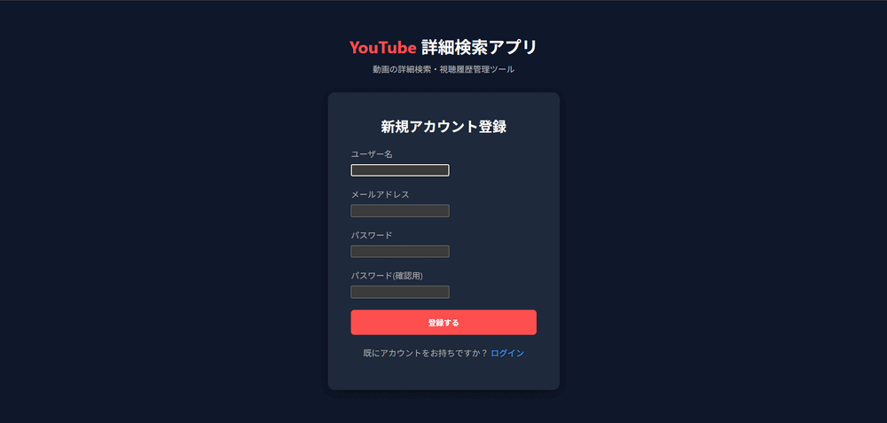
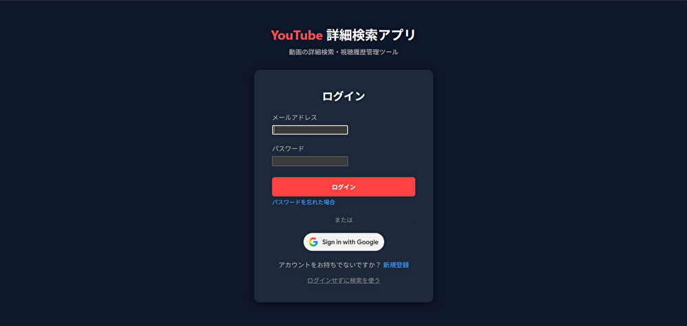
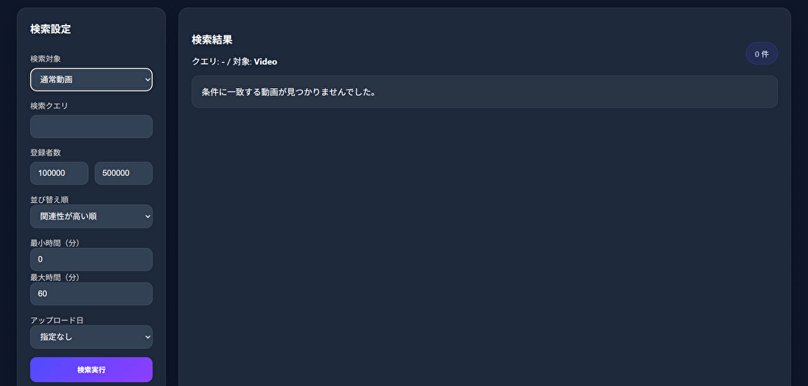
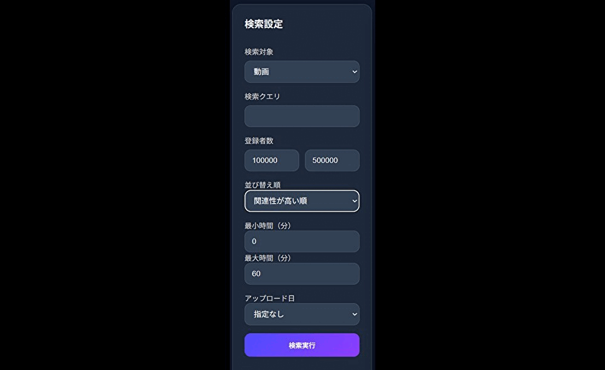
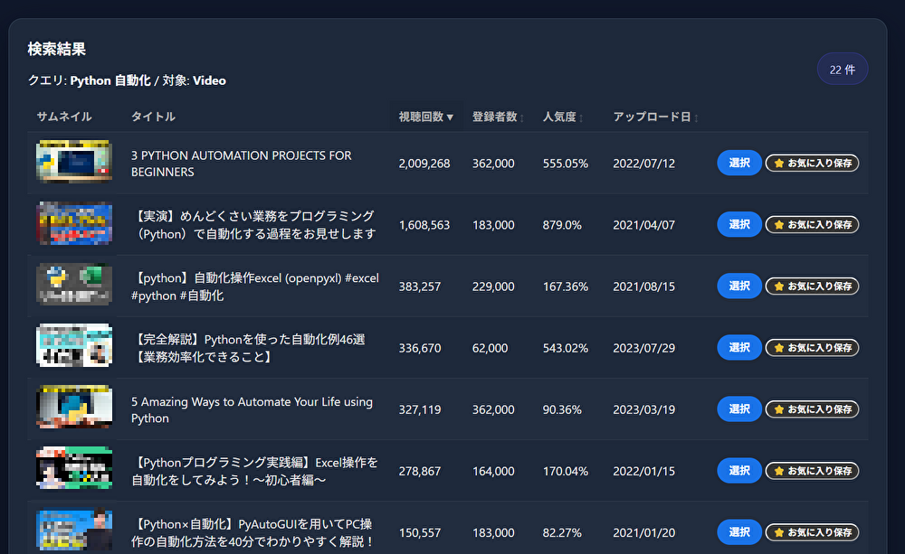
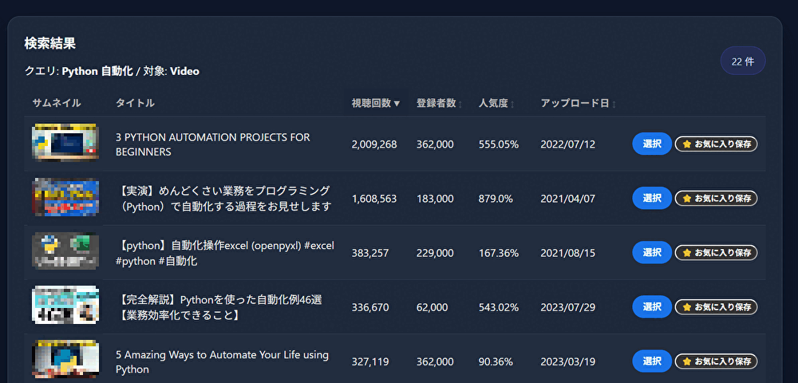
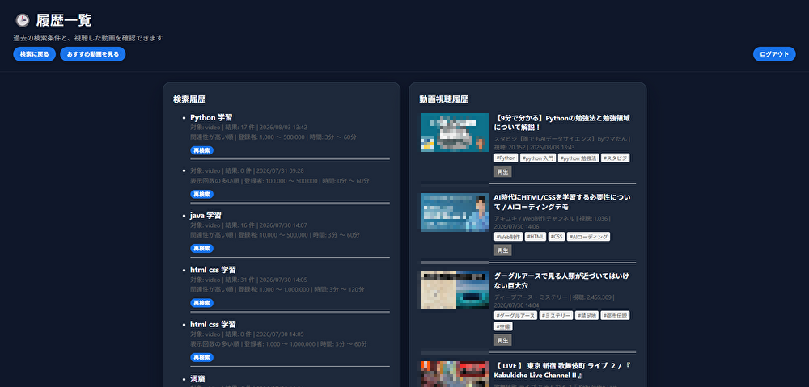
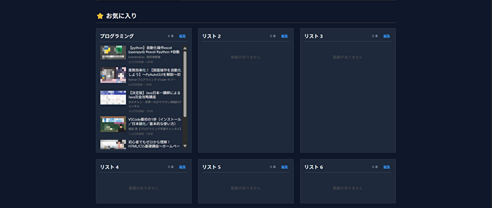
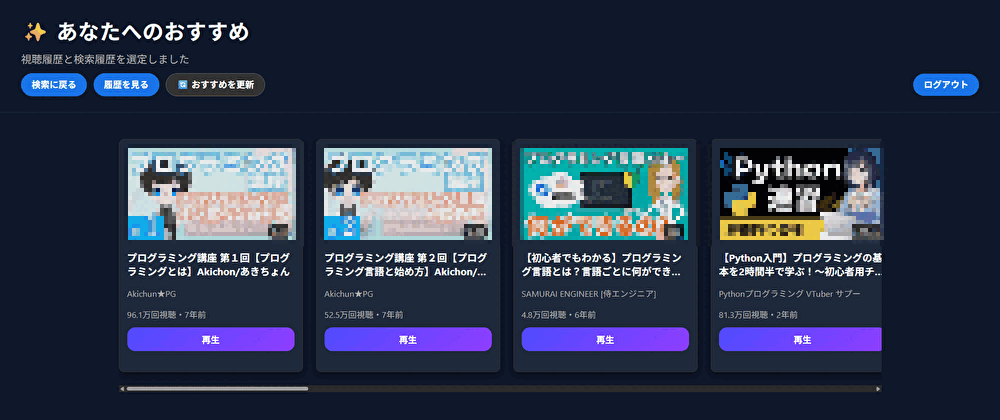
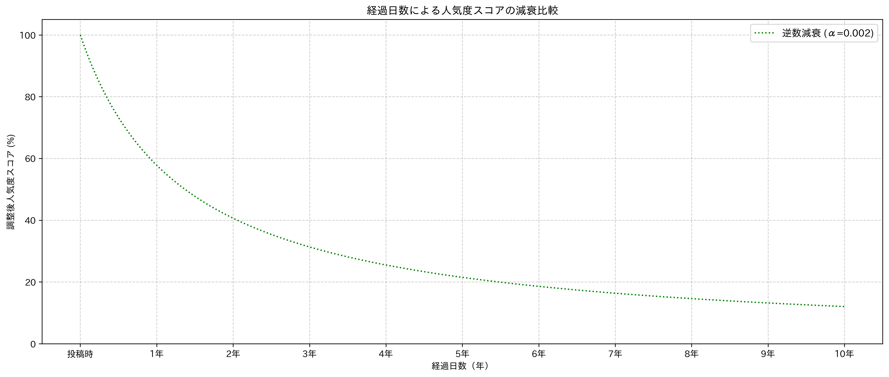

# Youtube詳細検索アプリ

## 概要
Youtube詳細検索アプリです。
動画・ライブ配信に対応しています。
- **App URL**: https://rezi7mn.pythonanywhere.com/login/
- **テスト用アカウント**:
  - メールアドレス: `test1@mail.com` / Pass: `abcd1111`

 

## 開発背景
普段日常的に利用しているYouTube公式の検索機能において、「動画の詳細な絞り込みがしづらい」  
「検索結果が煩雑で見づらい」といった使いづらさや痒いところに手が届かない課題を感じていました。  
そこで、既存のサービスでは満たせない細かな検索ニーズに応え、  
より効率的でストレスのない動画検索体験を提供したいと考え、本アプリケーションの開発に至りました。

 

## 主な機能一覧
| ログイン機能 | マルチターゲット検索 |
| ---- | ---- |
|  |  |
| メールアドレスとパスワードでの認証機能と、Google OAuth 2.0 による外部認証を実装しました。 | 通常の動画、動画全般、ライブ配信、アーカイブを切り替えて検索可能。 |

| 詳細フィルタリング | 人気度 |
| ---- | ---- |
|  |  |
| チャンネル登録者数、動画時間（分単位）等によるフィルタが可能。 | 登録者数、視聴数、経過日数から人気度を算出し、動画・ライブの盛り上がりを可視化。 |

| ソート機能 | 履歴機能 |
| ---- | ---- |
|  |  |
| 視聴回数、登録者数、人気度、アップロード日による並び替えが可能。 | 最新100件の検索条件と視聴履歴を保存。ワンクリックでの「再検索」に対応。 |

| お気に入りリスト | おすすめ動画機能 |
| ---- | ---- |
|  |  |
| 動画・ライブを好きなリストに保存可能。リストから再生も行えます。 | パーソナライズされたおすすめ動画を提示します。 |

 

## 使用技術

| Category | Technology Stack |
| :--- | :--- |
| **Frontend** | HTML5 / CSS3 / JavaScript (Vanilla JS) / HTMX |
| **Backend** | Python 3.13 / Django 6.0 |
| **Database** | SQLite3 |
| **Platform** | PythonAnywhere |
| **API / External Services** | YouTube Data API v3 / Google OAuth 2.0 |
| **etc.** | Git / GitHub |

 

## 設計図
本アプリケーションでは、実装前に要件・機能・データ構造を整理し、設計内容をもとに実装を進めました。

1.要件定義
 - 開発目的・解決したい課題を整理
 - 必要な機能・非機能要件を整理

2.機能要件
 - 各機能の仕様を整理
 - 画面・処理フローを設計

3.DB設計
 - テーブル・カラム・リレーションを設計
 - ER図を作成

4.実装
 - Django / HTMX / JavaScript等を使用して実装

5.動作確認・改善
 - 実装した機能を確認
 - UI/UXやパフォーマンスを改善

 

 

## 開発で工夫したこと・技術的こだわり
* **1. HTMXの活用による非同期処理と快適なUI/UX**

  【課題】 動画の再生や検索結果の並び替えのたびに画面全体がリロードされ、ユーザーに表示のちらつきや  
  待ち時間によるストレスを与えてしまう。

  【解決策】 画面全体の再描画を避け、更新が必要な部分のみをHTMXを用いて非同期（`Ajax`）で差し替える構成を採用。

  【結果】 ユーザーの利便性を高め、快適なUI/UXを実現。

* **2. おすすめ動画機能の実装における工夫**

  【課題】 公式APIではYouTubeのおすすめ動画アルゴリズムを取得できないため、ユーザーに最適化された動画を提示できない。

  【解決策】 形態素解析ライブラリ（`Janome`）と TF-IDF（`scikit-learn`）を導入。視聴履歴から名詞を抽出し、  
  ユーザーごとの「重要キーワード」を算出することで、検索履歴との組み合わせにより独自の検索クエリ生成ロジックを構築。

  【結果】 単なる履歴の再現ではなく、パーソナライズされた精度の高いおすすめ動画の提示を実現。

* **3. APIクォータ消費の最適化**

  【課題】公式APIは1日あたりのクォータ制限が厳しく、検索や動画詳細の取得リクエストを  
  毎回無制限に送信すると、すぐに上限に達してアプリが停止するリスクがある。 

  【解決策】 検索結果（60分）や動画詳細データ（10分）をメモリへキャッシュし、同一ユーザーや他ユーザーの  
  重複アクセス時のAPI呼び出しを抑止。また、バッチ取得処理により、動画情報取得時に1回のリクエストで一括取得するよう実装。

  【結果】 無駄なリクエスト数を大幅に削減し、API上限に達するリスクを最小限に抑えるとともに、2回目以降のページ表示速度を向上。
  
* **4. 人気度アルゴリズム**

  【課題】 動画単体でどれだけ人気があるかを表す指標を表示したい。

  【解決策】 再生回数をチャンネル登録者数で割ることで、チャンネルの規模に依存しない動画単体の純粋な人気度を可視化。  
  また、2乗逆数モデルを採用し、古い動画ほどスコアが下がる「時間減衰」の仕組みを導入。

  【結果】 新しいトレンド動画を優遇しつつも、一定期間経過後は減衰量に大きな差が出ない、実用的な人気度パラメータを実現。
   
   

 

## 今後の展望
 - GitHub Actionsの導入によるデプロイの自動化
 - クォータ上限の引き上げと、それに伴うおすすめ動画機能の改善・DBの移行
 - YouTube Live Chat API を使用した埋め込みチャットの表示
 - パスワード再設定メールサービスの改善
 - スマートフォン・タブレットでの利用を想定したUIの改善
 - Googleアカウントを用いたYouTubeのデータとの連携
