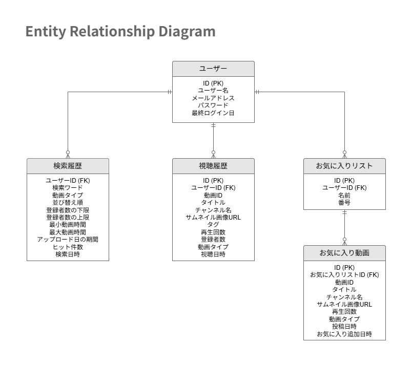

# サービス名（アプリ名）

## 概要
Youtube動画詳細検索アプリです。
動画・ライブ配信に対応しています。
- **App URL**: https://rezi7mn.pythonanywhere.com/login/
- **テスト用アカウント**:
  - メールアドレス: `test1@mail.com` / Pass: `abcd1111`

 

## 開発背景
普段日常的に利用しているYouTube公式の検索機能において、「動画の詳細な絞り込みがしづらい」  
「検索結果が煩雑で見づらい」といった使いづらさや痒いところに手が届かない課題を感じていました。  
そこで、既存のサービスでは満たせない細かな検索ニーズに応え、  
より効率的でストレスのない動画検索体験を提供したいと考え、本アプリケーションの開発に至りました。

---
普段の動画視聴の中で、公式YouTubeの検索機能に対して感じていた課題意識から本アプリを企画・開発しました。

* **課題意識**

  * 公式の検索フィルターでは、求めている条件での細かな絞り込みが難しい。

  * 毎回同じような検索条件を入力・調整するのに手間がかかる。

* **解決アプローチ**

  * 痒いところに手が届く「詳細検索機能」の実装

  * ユーザー目線に立った直感的なUI/UXの設計

 

## 主な機能一覧
* **ログイン機能**: メールアドレスとパスワードでの認証機能とGoogle OAuth 2.0 による外部認証を実装しました。
* **マルチターゲット検索**: 通常の動画とライブ配信を切り替えて検索可能。
* **詳細フィルタリング**: チャンネル登録者数、動画時間（分単位）等によるフィルタが可能。
* **ソート機能**: 視聴回数、登録者数、人気度、アップロード日による並び替えが可能。
* **履歴機能**: 最新100件の検索条件と視聴履歴を保存。ワンクリックでの「再検索」に対応。
* **お気に入りリスト**: 動画・ライブを好きなリストに保存可能。
* **おすすめ動画機能**: パーソナライズされたおすすめ動画を提示します。

 

## 使用技術

| Category | Technology Stack |
| :--- | :--- |
| **Frontend** | HTML5 / CSS3 / JavaScript (Vanilla JS) / HTMX |
| **Backend** | Python 3.13 / Django 6.0 |
| **Database** | SQLite3 |
| **Platform** | PythonAnywhere |
| **API / External Services** | YouTube Data API v3 / Google OAuth 2.0 |
| **etc.** | Git / GitHub |

 

## 設計図

### ER図

 

## 開発で工夫したこと・技術的こだわり
* **1. HTMXの活用による非同期処理と快適なUI/UX**
  * 動画の再生や、検索結果の並び替えのたびに画面全体がリロードされると、ユーザーに表示のちらつきや  
  待ち時間によるストレスを与えてしまう課題がありました。画面全体の再描画を避け、  
  更新が必要な部分のみをHTMXを用いて非同期（`Ajax`）で差し替える構成を採用しました。
* **2. おすすめ動画機能の実装における工夫**
  * YouTubeのAPIを使用して公式のおすすめ動画アルゴリズムを使用することはできません。  
  そのため、ユーザーの直近の視聴履歴・検索履歴から関心領域を自動分析する独自の検索クエリ生成ロジックを構築しました。  
  形態素解析ライブラリ（`Janome`）を用いて視聴履歴のタイトルから名詞を抽出後、  
  TF-IDF（`scikit-learn`）を適用してユーザーが頻繁に視聴している「重要キーワード」を算出。  
  「直近の検索ワード」を組み合わせた動的な検索クエリを生成することで、パーソナライズされたおすすめ動画の提示を実現しました。
* **3. APIクォータ消費の最適化**
  * YouTube Data API v3 は1日あたりのクォータ制限が厳しく、検索や動画詳細の取得リクエストを  
  毎回無制限に送信すると、すぐに上限に達してアプリが停止するリスクがありました。  
  検索結果（20分）や動画詳細データ（5分）をメモリへキャッシュ。同一ユーザーや他ユーザーの  
  重複アクセス時のAPI呼び出しを抑止しました。  
  また、バッチ取得処理により、動画情報取得時に1回のリクエストで一括取得する実装を行いました。これにより、  
  無駄なリクエスト数を大幅に削減し、API上限に達するリスクを最小限に抑えるとともに、  
  2回目以降のページ表示速度（レスポンスタイム）を向上させました。

 

## 今後の展望
 - GitHub Actionsの導入によるデプロイの自動化
 - クォータ上限の引き上げと、それに伴うおすすめ動画機能の改善